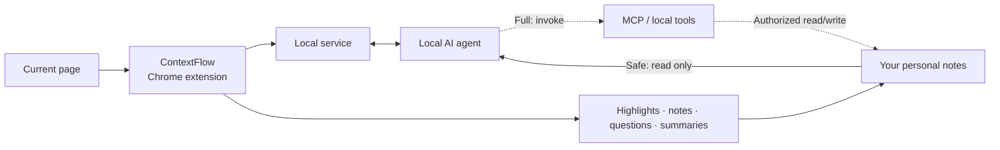

<p align="center">
  
  
</p>

<p align="center">
  <b>Bring what you understood before into everything you read next.</b><br>
  <sub>A Chrome extension connecting the page in front of you, your personal notes, and local AI.</sub><br>
  <sub><a href="./README.md">中文</a></sub>
</p>

---

## Every reading session should not start from zero

Your browser sees what you are reading now. Your notes preserve what you genuinely
thought before.

Most of the time, those two worlds are disconnected. A claim feels familiar, but you
cannot recover your earlier judgment. You want to verify an idea, so you search from
scratch. A question you left unresolved months ago does not return when today's article
finally contains the missing evidence.

**ContextFlow reconnects them.**

It preserves highlights, annotations, questions, and summaries in the browser, while a
local AI agent can read the notes you explicitly authorize. The answer can therefore use
not only the current page, but also what you previously read, doubted, and accepted.

This is not another chat box inside the browser. It brings your personal knowledge back
into the act of reading.

---

## Bring personal knowledge into the current article

| While reading | What ContextFlow can do |
|---|---|
| **Compare as you read** | Surface related definitions, earlier conclusions, and counterexamples from your notes |
| **Cross-check an idea** | Place supporting evidence, conflicting evidence, and assumptions side by side; distinguish independent sources from repeated citations |
| **Trace how your view changed** | Reconstruct how a question became a hypothesis and how later evidence revised it |
| **Let unfinished questions return** | Resurface an old open question when a new article contains relevant evidence |
| **Write back into the same thread** | Store the new judgment, quoted passage, and source next to the knowledge it extends |

The important change is not better note search. It is a layer of **personal context that
persists across time**.

---

## A real reading session can look like this

You are reading a new paper about long-term memory and ask:

> **Is this conclusion consistent with what I have read before?**

ContextFlow explains the current passage, then lets the local agent compare it with your
notes:

> The paper argues that long-term memory depends on retrieving context at the right time,
> not on storing as much as possible.
>
> - This supports your April note: the value of memory is retrieval timing, not storage volume.
> - It conflicts with an experiment you recorded in June: a wrong retrieval can be worse than no retrieval.
> - The two sources use different tasks and evaluation criteria. They point in a similar direction, but do not yet prove each other.

The point is not a longer answer. **What you understood before is participating in the
judgment you make now.**

---

## From one-off answers to a personal knowledge loop



- **ContextFlow** understands the reading session: article text, selection, context,
  annotations, and questions.
- The **local agent** connects that session to earlier knowledge and may use file or MCP
  tools within the permissions you grant.
- **Note backends** keep the durable, portable assets instead of locking them inside the
  extension.
- The **next reading session** can consume those assets again, turning documents into a
  growing personal knowledge network.

The default Safe profile exposes only reading and retrieval capabilities: Codex runs in a
read-only sandbox, while Claude Code is constrained with explicit tool allow/deny rules.
Writes, shell commands, MCP, and persistent sessions remain isolated. Only the opt-in Full
profile inherits the MCP servers and other capabilities already configured for your agent.

---

## What is implemented

### The reading surface

- Four-color highlights and annotations
- Translation using full-article context
- Article brief, passage explanation, and follow-up questions
- Whole-article summary
- Two-way navigation between source marks and reading records
- Highlight restoration after reload or revisit

### Personal knowledge connection

- Route **Explain** to a locally installed AI agent such as Claude Code, Codex, or another
  supported CLI agent
- Grant the agent read-only access to an explicit notes directory
- Retrieve and compare earlier judgments, then bring relevant notes into the current answer
- Safe and advanced full-permission agent profiles
- Asynchronous jobs, progress states, and local caching, so you can keep reading while an
  answer is generated

### Durable notes and sync

- One long-lived document per article
- **Obsidian**, **SiYuan**, and plain **Markdown directory** backends
- Idempotent sync: repeated syncs do not append duplicates
- In-place updates for summaries and managed blocks
- Source text, question, answer, annotation, and source URL preserved together

---

## Your notes remain yours

A synced article looks roughly like this:

```markdown
# Stealing Reasoning Traces from Proprietary LLM APIs

## Brief
The paper presents an attack that recovers hidden reasoning traces through a public API.

## Explanation
**❓ Is this conclusion consistent with what I have read before?**
> Threat model

The current claim supports your earlier view about retrieval timing, but conflicts with
another experiment in your notes…

## Annotation
> attackers can only query the model through its public API

This assumption determines the attack cost and should be considered alongside the
feasibility question recorded earlier.

## Summary
Core contribution, agreements with existing notes, conflicts, and open questions.
```

It is ordinary Markdown and can live directly in your existing note system. If you stop
using ContextFlow, the content remains readable, searchable, and portable.

---

## Local-first by architecture

- The local service listens only on `127.0.0.1`; structured data stays in local SQLite
- The LLM API key stays in the local service; the service token is injected only into the extension service worker. Neither enters page code
- Content scripts hold no service credentials
- Notes are written directly to your folder or note application, with no ContextFlow cloud
- No ContextFlow account and no hosted personal knowledge base
- You can keep annotating while the service is offline and continue processing later
- The agent receives read-only access to the notes directory by default

---

## Getting started

Requires **Node.js ≥ 22.5** and a Chromium 111+ browser.

```bash
git clone https://github.com/PengheLiu/ContextFlow.git
cd ContextFlow
npm install
npm run server        # terminal A: creates ~/.contextflow/config.json on first run

# Open terminal B
npm run build:ext     # prints the stable extension ID and chrome-extension:// origin
```

Then:

1. Add the printed `chrome-extension://<id>` to `allowedOrigins` in `~/.contextflow/config.json`.
2. Restart the local service so the updated origin allowlist takes effect.
3. Open `chrome://extensions` and enable Developer mode.
4. Choose **Load unpacked** and select `extension/dist`.
5. Open any article and enter **Settings** in the ContextFlow side panel.
6. Configure the LLM used for translation, your notes backend, and an optional local agent.

To let an agent use personal notes, click **Detect**, choose an installed agent, and
explicitly select the notes directory it may read.

> The current interface and generated note headings are primarily Chinese. Contributions
> that extract the strings into an English locale are welcome.

---

## Configuration

The configuration file is `~/.contextflow/config.json`:

| Key | Purpose |
|---|---|
| `explain.backend` | `llm` for a fast answer; `agent` for an answer grounded in personal notes |
| `agent.id` | Which local agent to use |
| `agent.notesDir` | The notes directory the agent may read |
| `agent.profile` | `safe` for minimal read-only access; `full` to inherit the agent's complete capabilities |
| `translate.chunkChars` | Article context sent per translation turn; `0` disables full-article context |
| `sync.backend` | `siyuan` / `obsidian` / `markdown` |
| `allowedOrigins` | Origins allowed to access the local service; for the extension, add the `chrome-extension://<id>` printed by `build:ext` |

---

## Known limits

- Extensions cannot enter the browser's built-in PDF viewer. For arXiv, use the `/abs/`
  or `/html/` version instead of `/pdf/`.
- A local agent needs time and quota to read and reason over your notes, so it is slower
  than a direct LLM answer.
- After a major page redesign, a small number of highlights may no longer resolve. They
  are marked as orphaned and never silently discarded.
- Full-permission mode may inherit shell, network, and MCP capabilities. Enable it only
  after understanding the risk.

---

## Why it is built this way

[DESIGN.md](./DESIGN.md) records the architecture tradeoffs and measurements behind the
implementation, including:

- Why highlighting uses the CSS Custom Highlight API instead of injected `<span>` elements
- The multi-tier anchoring strategy and measured hit rates
- Why the reading surface and durable notes use separate storage layers
- How long-running local-agent jobs avoid blocking the reading experience
- Why a tool allow-list is not a substitute for permission isolation
- Credential boundaries between the extension service worker, local service, and page
  environment

## License

MIT. A personal project, provided as is.
