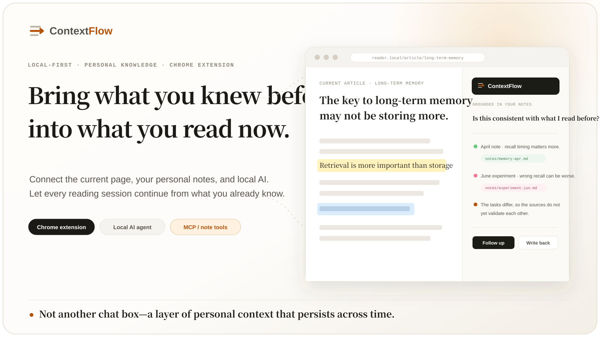
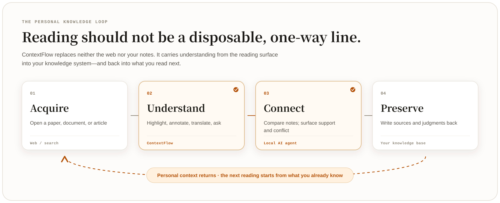
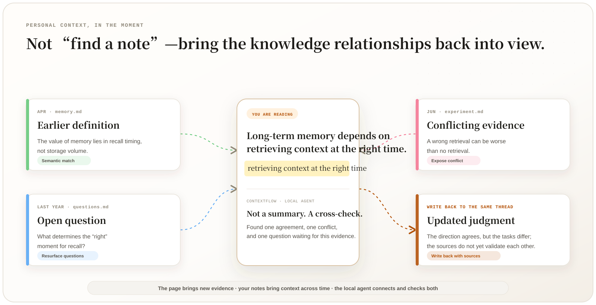
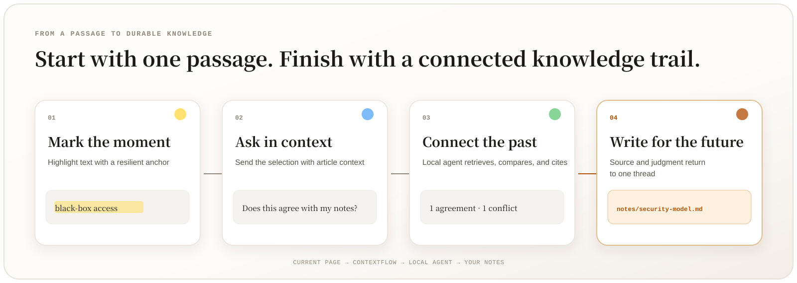
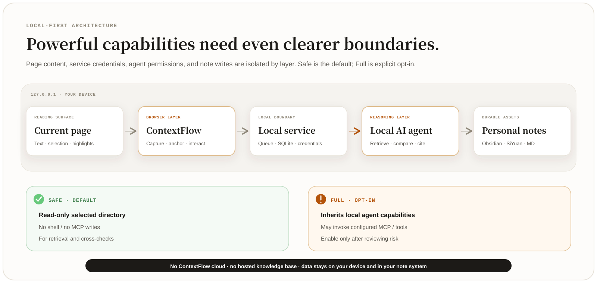

<p align="center">
  
</p>

<p align="center">
  <a href="#reading-should-be-a-loop"><strong>Vision</strong></a> ·
  <a href="#when-personal-knowledge-returns-to-the-page"><strong>Reading scenarios</strong></a> ·
  <a href="#from-one-passage-to-a-reusable-knowledge-trail"><strong>Capabilities</strong></a> ·
  <a href="#a-complete-controlled-local-path"><strong>Architecture</strong></a> ·
  <a href="#getting-started"><strong>Get started</strong></a>
  <br><br>
  <code>Chrome Extension</code> · <code>Local-first</code> · <code>Local AI Agent</code> · <code>MCP</code> · <code>Obsidian / SiYuan / Markdown</code>
  <br>
  <sub><a href="./README.md">中文</a></sub>
</p>

---

## Reading should be a loop

The web knows **what you are reading now**. Your notes preserve **what you genuinely thought before**.

In practice, reading is usually a broken one-way line. The article closes, highlights remain trapped on the page, and judgments disappear into a chat window. Months later, you meet the same idea and search, understand, and verify it all over again.

**ContextFlow captures the thinking that happens while you read and returns it to your personal knowledge system.**

<p align="center">
  
</p>

It does not replace the web, your note application, or your knowledge base. It reconnects the parts most likely to be lost:

1. Preserve highlights, annotations, questions, translations, and summaries on the page;
2. Let a local AI agent read only the notes you authorize and bring earlier understanding into the current article;
3. Write the new judgment, quoted passage, and source back into the knowledge thread it extends.

This is not another chat box in the browser. It is a layer of **personal context that persists across articles and across time**.

---

## When personal knowledge returns to the page

<p align="center">
  
</p>

AI can answer more than “what does this paragraph mean?” It can use what you have already collected to help with the questions that real thinking requires.

<details>
<summary><strong>01 · Compare while reading</strong>　Is this the same idea I recorded before?</summary>
<br>

When a concept feels familiar, ask the local agent to find earlier definitions, judgments, and counterexamples, then explain whether the current article restates, narrows, or revises them.

> **Current article:** Long-term memory depends on retrieving context at the right time.
>
> **Your notes:** In April you wrote, “The value of memory lies in retrieval timing, not storage volume.”
>
> **ContextFlow:** The direction agrees, but the current article introduces a stricter task condition.

</details>

<details>
<summary><strong>02 · Cross-check an idea</strong>　Surface conflict instead of collecting only support</summary>
<br>

Place supporting evidence, conflicting evidence, and assumptions side by side. Distinguish independent evidence from repeated citations and incompatible evaluation criteria.

> This article supports your April judgment but conflicts with an experiment you recorded in June. The sources use different tasks and metrics, so they point in a related direction but do not yet validate each other.

</details>

<details>
<summary><strong>03 · Trace how your view changed</strong>　Why do I believe something different now?</summary>
<br>

Reconstruct how a question became a hypothesis and how later evidence revised it. Notes preserve not only conclusions, but the path by which your thinking changed.

> Last year: Is more retrieval always better? → April: timing may matter more than volume → June: wrong retrieval can be worse than none → Today: what determines the right moment?

</details>

<details>
<summary><strong>04 · Let unfinished questions return</strong>　Does this new evidence answer an old question?</summary>
<br>

Ask the agent to find unresolved questions related to the current passage. After confirmation, write the evidence, judgment, and source next to that question instead of creating another isolated conversation.

> An old question should not disappear because you forgot to search for it. It should return when the missing evidence appears.

</details>

The meaningful change is not better note search. **What you understood before begins to participate in the judgment you make now.**

---

## From one passage to a reusable knowledge trail

<p align="center">
  
</p>

<table>
  <tr>
    <td width="33%" valign="top">
      <strong>Reading surface</strong><br><br>
      Four-color highlights and annotations<br>
      Translation with article context<br>
      Article overview and summary<br>
      Selection explanation and follow-ups<br>
      Two-way navigation to source text<br>
      Highlight restoration after reload
    </td>
    <td width="34%" valign="top">
      <strong>Personal context</strong><br><br>
      Local Claude Code / Codex integration<br>
      Explicitly authorized notes directory<br>
      Cross-note retrieval and semantic links<br>
      Comparison with earlier judgments<br>
      Note-source citations<br>
      Async jobs and local caching
    </td>
    <td width="33%" valign="top">
      <strong>Preservation and sync</strong><br><br>
      One durable document per article<br>
      Obsidian / SiYuan / Markdown backends<br>
      Idempotent repeated synchronization<br>
      In-place updates for edited content<br>
      Source, question, answer, and links together<br>
      Readable, searchable, portable data
    </td>
  </tr>
</table>

The goal is not to generate more content. It is to leave behind **source text you can locate, evidence you can verify, and judgments that can continue to evolve**.

---

## A complete, controlled local path

<p align="center">
  
</p>

### Local-first by architecture

- The local service listens only on `127.0.0.1`; structured data stays in local SQLite;
- The LLM API key remains in the local service, while the service token is injected only into the extension service worker. Neither reaches page code;
- Content scripts hold no service credentials;
- Notes are written directly to your folder or note application, with no ContextFlow cloud;
- There is no ContextFlow account and no hosted personal knowledge base;
- You can keep annotating while the service is offline and continue processing after it returns.

### Safe by default, Full by explicit choice

| Profile | Best for | Boundary |
|---|---|---|
| **Safe (default)** | Note retrieval, comparison, and cross-checking | The agent receives read-only access to a selected notes directory; writes, shell commands, MCP, and persistent sessions are isolated |
| **Full (opt-in)** | Complete workflows already configured in your local agent | May inherit shell, network, MCP, and other local tool capabilities; enable only after reviewing the risk |

ContextFlow understands the reading session in front of you. The local agent relates it to earlier knowledge. MCP and note backends connect existing tools and durable assets. The closer a capability gets to execution, the more important permissions, confirmations, and source isolation become.

---

## Your notes remain yours

A synchronized article is ordinary, portable Markdown—not a private format that only ContextFlow can open.

<details>
<summary><strong>Expand an example of what one reading session leaves behind</strong></summary>
<br>

```markdown
# Stealing Reasoning Traces from Proprietary LLM APIs

## Overview
The paper presents an attack that reconstructs reasoning traces through a public API.

## Explanation
**❓ Is this conclusion consistent with what I read before?**
> Threat model

The claim supports your earlier judgment about retrieval timing but conflicts with
another experiment. The tasks and metrics differ, so the sources do not yet validate each other.

## Annotation
> attackers can only query the model through its public API

This assumption determines attack cost and should be read alongside the feasibility
question recorded earlier.

## Summary
Core contribution, agreements with existing notes, conflicts, and open questions.
```

</details>

If you stop using ContextFlow, the content remains readable and searchable—and other editors, scripts, and AI tools can continue working with it.

---

## Getting started

Requires **Node.js ≥ 22.5** and a **Chromium 111+** browser.

```bash
git clone https://github.com/PengheLiu/ContextFlow.git
cd ContextFlow
npm install
npm run server        # terminal A: creates ~/.contextflow/config.json on first run

# Open terminal B
npm run build:ext     # prints the stable extension ID and chrome-extension:// origin
```

Then:

1. Add the printed `chrome-extension://<id>` to `allowedOrigins` in `~/.contextflow/config.json`;
2. Restart the local service so the updated origin allowlist takes effect;
3. Open `chrome://extensions` and enable Developer mode;
4. Choose **Load unpacked** and select `extension/dist`;
5. Open an article and enter **Settings** in the ContextFlow side panel;
6. Configure the LLM used for translation, your note backend, and an optional local agent.

To let an agent use personal notes, click **Detect**, choose an installed agent, and explicitly select the notes directory it may read.

> The current interface and generated note headings are primarily Chinese. Contributions that extract strings into an English locale are welcome.

<details>
<summary><strong>Configuration reference</strong></summary>
<br>

The configuration file is `~/.contextflow/config.json`:

| Key | Purpose |
|---|---|
| `explain.backend` | `llm` for a fast answer; `agent` for an answer grounded in personal notes |
| `agent.id` | Which local agent to use |
| `agent.notesDir` | The notes directory the agent may read |
| `agent.profile` | `safe` for minimal read-only access; `full` to inherit the agent's complete capabilities |
| `translate.chunkChars` | Article context sent per translation turn; `0` disables full-article context |
| `sync.backend` | `siyuan` / `obsidian` / `markdown` |
| `allowedOrigins` | Origins allowed to access the local service; add the printed `chrome-extension://<id>` |

</details>

---

## Known limits

- Extensions cannot enter the browser's built-in PDF viewer. For arXiv, use `/abs/` or `/html/` instead of `/pdf/`;
- A local agent needs time and quota to read and reason over notes, so it is slower than a direct LLM answer;
- After a major page redesign, a small number of highlights may no longer resolve. They are marked as orphaned and never silently discarded;
- Full mode may inherit shell, network, and MCP capabilities. Enable it only after understanding the risk.

## Why it is built this way

[DESIGN.md](./DESIGN.md) records the architecture tradeoffs and measurements behind the implementation, including:

- Why highlighting uses the CSS Custom Highlight API instead of injected `<span>` elements;
- The multi-tier anchoring strategy and measured hit rates;
- Why the reading surface and durable notes use separate storage layers;
- How long-running local-agent jobs avoid blocking the reading experience;
- Why a tool allow-list is not a substitute for permission isolation;
- Credential boundaries between the extension service worker, local service, and page environment.

---

<p align="center">
  <strong>A truly personal AI does not merely read more articles for you.<br>It lets what you understood before participate in everything you read next.</strong>
</p>

<p align="center">
  <sub>MIT License · A local-first personal project</sub>
</p>
