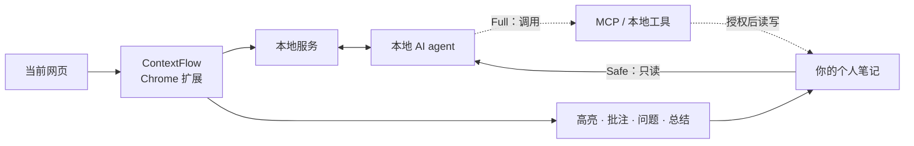

<p align="center">
  
  
</p>

<p align="center">
  <b>让你过去的理解，在每一次新阅读中重新参与思考。</b><br>
  <sub>一个把当前网页、个人笔记与本地 AI 连接起来的 Chrome 扩展。</sub><br>
  <sub><a href="./README.en.md">English</a></sub>
</p>

---

## 每一次阅读，都不该从零开始

浏览器看见你此刻正在读的，笔记保存你过去真正想过的。

但大多数时候，两者彼此断开：读到一个熟悉的观点，你隐约记得以前见过，却找不到当时的判断；
想验证一个结论，只能重新搜索；几个月前留下的问题，即使今天遇到了答案，也不会主动回来。

**ContextFlow 把这两部分接起来。**

它在网页中保留你的高亮、批注、问题与总结，同时把当前阅读交给本地 AI agent，
让 agent 在你授权的范围内读取个人笔记。于是 AI 不只理解眼前这一页，也知道你过去读过什么、
怀疑过什么、被什么证据说服过。

这不是给浏览器再加一个聊天框，而是让个人知识重新回到阅读现场。

---

## 把个人知识带回当前文章

| 阅读现场 | ContextFlow 可以做什么 |
|---|---|
| **边读边对照** | 读到一个概念时，找出笔记里的相关定义、旧结论与反例，把“这一次”与“上一次”接起来 |
| **交叉验证想法** | 并列不同文章里的支持证据、反对证据与适用前提，区分独立来源和相互引用 |
| **看见认知演化** | 沿时间回看一个观点如何从疑问变成假设，又如何被新证据修正 |
| **让问题自己回来** | 当新材料与过去未解决的问题相关时，把那个问题重新带回眼前 |
| **继续写回知识库** | 将新判断、原文引用和来源链接写回原来的知识脉络，而不是留下另一段孤立对话 |

真正的变化不是“更方便地搜索笔记”，而是浏览器第一次拥有了一层**跨时间的个人上下文**。

---

## 一次真实的阅读会变成这样

你正在读一篇关于长期记忆的新论文，选中一句，问：

> **这个结论，和我以前读到的一致吗？**

ContextFlow 不只解释当前段落，还可以让本地 agent 对照你的笔记：

> 这篇文章认为，长期记忆的关键是“在正确时机召回上下文”，而不是保存得越多越好。
>
> - 呼应你 4 月的笔记：记忆的价值在召回时机，不在存储规模。
> - 但它与 6 月记录的一项实验有冲突：错误召回有时比没有召回更糟。
> - 两个来源使用了不同任务与评测口径；目前只能说方向相关，还不能相互证明。

关键不在于答案更长，而在于：**你过去留下的理解，参与了这一次判断。**

---

## 从单次回答，到个人知识回路



- **ContextFlow** 理解当前阅读：正文、选区、上下文、批注与问题。
- **本地 agent** 负责关联过去的知识，并在授权范围内使用文件或 MCP 工具。
- **笔记后端** 保存可迁移的长期资产，而不是把数据锁在扩展里。
- **下一次阅读** 会再次消费这些资产，形成持续生长的个人知识网络。

默认的 Safe 模式只开放读取与检索能力：Codex 使用只读沙箱，Claude Code 通过工具白名单与
显式拒绝规则收紧权限；写入、命令、MCP 与持久会话被隔离。只有主动开启 Full 模式，
agent 才会继承本机已经配置的 MCP 与其他完整能力。

---

## 已经实现的能力

### 阅读现场

- 四色高亮与批注
- 基于全文上下文的翻译
- 文章速览、选区解释与连续追问
- 全文总结
- 原文标记与阅读记录双向定位
- 刷新或重新打开页面后恢复高亮

### 个人知识连接

- 将“解释”交给本机已安装的 AI agent，例如 Claude Code、Codex 或其他受支持的 CLI agent
- 授权 agent 只读访问指定笔记目录
- 跨笔记检索、对比已有判断，并把相关内容带回当前回答
- 支持安全权限与高级完整权限两种 agent 运行模式
- 异步任务、进度状态与本地缓存：可以继续阅读，不必守着回答生成

### 沉淀与同步

- 一篇文章对应一个长期文档
- 支持 **Obsidian**、**思源笔记** 与普通 **Markdown 文件夹**
- 重复同步保持幂等，不会反复追加相同内容
- 修改后的总结与托管区块原地更新
- 原文、问题、回答、批注与来源链接一起保留

---

## 你的笔记仍然属于你

一篇文章同步后大致是这样：

```markdown
# Stealing Reasoning Traces from Proprietary LLM APIs

## 速览
这篇论文提出一种通过公开 API 反推模型推理痕迹的攻击。

## 解释
**❓ 这个结论和我以前读到的一致吗？**
> Threat model

当前结论支持你此前关于“召回时机”的判断，但与另一项实验存在冲突……

## 批注
> attackers can only query the model through its public API

这个假设决定了攻击成本，需要和之前记录的现实可行性问题一起看。

## 总结
本文的核心贡献、与已有笔记的一致之处、冲突点及待验证问题。
```

它是普通 Markdown，也可以直接进入现有笔记软件。即使将来不再使用 ContextFlow，
这些内容仍然可读、可搜索、可迁移。

---

## Local-first，不是口号

- 本地服务只监听 `127.0.0.1`，结构化数据保存在本机 SQLite
- LLM API Key 只保存在本地服务；访问服务的 token 只注入扩展 service worker，二者都不进入网页环境
- 内容脚本不持有任何服务凭证
- 笔记直接写入你的文件夹或笔记软件，不经过 ContextFlow 云端
- 不需要 ContextFlow 账号，也没有托管你的个人知识库
- 服务暂时离线时仍可标注；本地服务恢复后再继续处理
- agent 默认只获得指定笔记目录的只读权限

---

## 开始使用

需要 **Node.js ≥ 22.5**，以及 Chromium 111+ 浏览器。

```bash
git clone https://github.com/PengheLiu/ContextFlow.git
cd ContextFlow
npm install
npm run server        # 终端 A：首次运行生成 ~/.contextflow/config.json

# 新开终端 B
npm run build:ext     # 构建扩展，并打印固定扩展 ID 与 chrome-extension:// 来源
```

然后：

1. 把 `build:ext` 打印的 `chrome-extension://<id>` 加入 `~/.contextflow/config.json` 的 `allowedOrigins`。
2. 重启本地服务，让新的来源白名单生效。
3. 打开 `chrome://extensions`，开启“开发者模式”。
4. 选择“加载已解压的扩展程序”，加载 `extension/dist`。
5. 打开任意正文网页，在 ContextFlow 面板中进入“配置”。
6. 配置翻译所用的 LLM、笔记位置，以及需要使用的本地 agent。

如果希望 agent 读取个人笔记，在配置中点击“检测”，选择本机 agent，并明确指定允许读取的笔记目录。

---

## 配置

配置文件位于 `~/.contextflow/config.json`：

| 配置 | 作用 |
|---|---|
| `explain.backend` | `llm`：快速解释；`agent`：结合个人笔记回答 |
| `agent.id` | 使用哪个本地 agent |
| `agent.notesDir` | agent 被允许只读访问的笔记目录 |
| `agent.profile` | `safe`：最小只读权限；`full`：继承本地 agent 的完整能力 |
| `translate.chunkChars` | 翻译时每轮携带的正文长度，`0` 表示不带全文上下文 |
| `sync.backend` | `siyuan` / `obsidian` / `markdown` |
| `allowedOrigins` | 允许访问本地服务的来源；扩展模式下加入 `build:ext` 打印的 `chrome-extension://<id>` |

---

## 已知边界

- 浏览器内置 PDF 阅读器不允许扩展进入页面正文。阅读 arXiv 时请使用 `/abs/` 或 `/html/` 版本。
- 本地 agent 需要读取和推理个人笔记，通常比普通 LLM 解释慢，也会消耗相应 agent 的额度。
- 页面结构发生大幅变化后，少量高亮可能无法重新定位；它们会被标记为“失锚”，不会静默丢失。
- 完整权限模式可能继承命令、网络与 MCP 能力，仅应在理解风险后主动开启。

---

## 为什么这样设计

[DESIGN.md](./DESIGN.md) 记录了实现中的架构取舍与实测数据，包括：

- 为什么使用 CSS Custom Highlight API，而不是向原网页注入 `<span>`
- 高亮锚点的多层降级与命中率
- 为什么阅读现场与长期笔记需要分层存储
- 如何让长时间运行的本地 agent 任务不阻塞阅读
- 为什么工具白名单仍不足以替代权限隔离
- 扩展 service worker、本地服务与网页环境之间的凭证边界

## License

MIT。个人项目，按现状提供。
