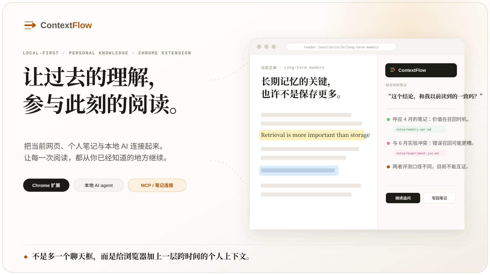
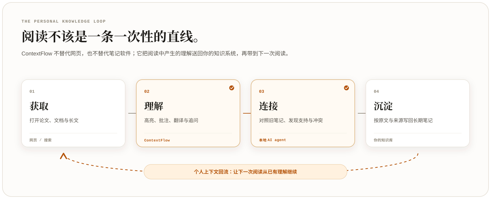
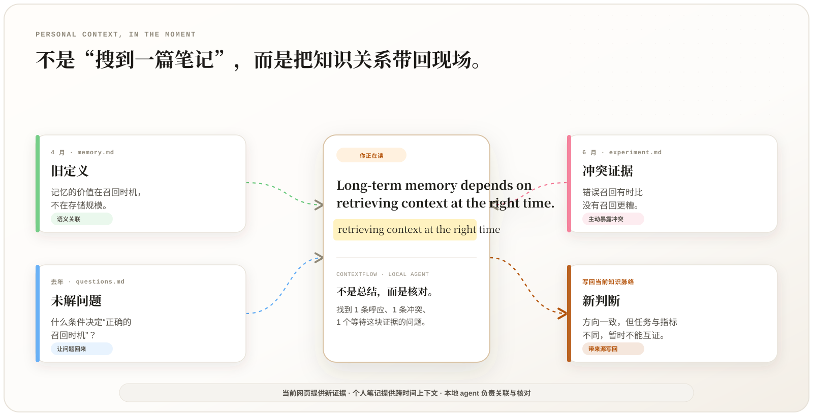
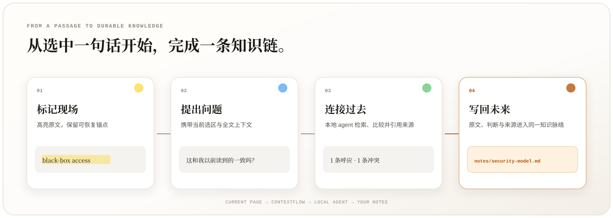
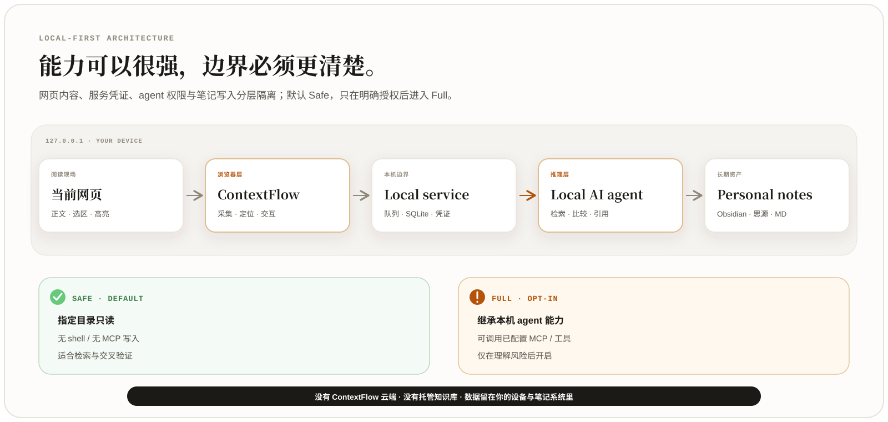

<p align="center">
  
</p>

<p align="center">
  <a href="#阅读本该是一条回路"><strong>产品愿景</strong></a> ·
  <a href="#当个人知识回到阅读现场"><strong>阅读场景</strong></a> ·
  <a href="#从一句原文到一条可复用的知识链"><strong>产品能力</strong></a> ·
  <a href="#一条完整可控的本地链路"><strong>架构与安全</strong></a> ·
  <a href="#开始使用"><strong>开始使用</strong></a>
  <br><br>
  <code>Chrome Extension</code> · <code>Local-first</code> · <code>Local AI Agent</code> · <code>MCP</code> · <code>Obsidian / 思源 / Markdown</code>
  <br>
  <sub><a href="./README.en.md">English</a></sub>
</p>

---

## 阅读，本该是一条回路

网页知道你**正在读什么**，笔记保存你**曾经想过什么**。

可现实中的阅读往往是一条断掉的直线：文章读完了，高亮留在网页里，判断散在聊天窗口中；几个月后遇到同一个概念，你仍然要重新搜索、重新理解、重新证明。

**ContextFlow 接住阅读发生的过程，并把它送回你的个人知识系统。**

<p align="center">
  
</p>

它不替代网页，不替代笔记软件，也不试图成为另一座知识孤岛。它只负责把最容易丢失的两段接起来：

1. 在网页上保留你的高亮、批注、问题、翻译与总结；
2. 让本地 AI agent 在你授权的范围内读取个人笔记，把过去的理解带回当前文章；
3. 再把新的判断、原文与来源写回原来的知识脉络。

这不是给浏览器再加一个聊天框，而是给浏览器增加一层**跨文章、跨时间的个人上下文**。

---

## 当个人知识回到阅读现场

<p align="center">
  
</p>

AI 不只回答“这段在讲什么”，还可以结合你已经积累的材料，回答更接近真实思考的问题。

<details>
<summary><strong>01 · 边读边对照</strong>　这个概念，和我以前记下的是一回事吗？</summary>
<br>

读到一个熟悉概念时，让本地 agent 找出笔记里的旧定义、判断与反例，并说明它们与当前文章的关系：是同义重述、条件不同，还是已经被新证据修正。

> **当前文章：** 长期记忆的关键是“在正确时机召回上下文”。
>
> **你的笔记：** 4 月曾写下“记忆的价值在召回时机，不在存储规模”。
>
> **ContextFlow：** 两者方向一致，但当前文章给出了更严格的任务条件。

</details>

<details>
<summary><strong>02 · 交叉验证想法</strong>　不要只找支持，也主动暴露冲突</summary>
<br>

将不同来源里的支持证据、反对证据和适用前提放在一起，区分独立证据、相互引用与口径差异。

> 这篇文章支持你 4 月的判断，但与你 6 月记录的一项实验冲突。两个来源使用了不同任务与评测指标，因此目前只能说方向相关，还不能互相证明。

</details>

<details>
<summary><strong>03 · 看见认知演化</strong>　我为什么改变了看法？</summary>
<br>

沿时间回看一个观点如何从疑问变成假设，又如何被后来证据修正。笔记不再只是结论的仓库，也保留思考发生的路径。

> 去年：召回越多是否越好？ → 4 月：关键也许是召回时机 → 6 月：错误召回可能比不召回更糟 → 今天：开始关注“什么条件决定正确时机”。

</details>

<details>
<summary><strong>04 · 让未完成的问题回来</strong>　新材料是不是回答了过去的问题？</summary>
<br>

让 agent 从笔记中寻找与当前段落相关的未解问题。确认后，将新证据、当前判断和原文来源写回那个问题旁边，而不是再生成一段孤立对话。

> 过去的问题不会因为你忘了翻笔记而消失；它会在新的证据出现时，重新回到阅读现场。

</details>

真正的变化不是“更方便地搜索笔记”，而是：**你过去留下的理解，开始参与今天的判断。**

---

## 从一句原文，到一条可复用的知识链

<p align="center">
  
</p>

<table>
  <tr>
    <td width="33%" valign="top">
      <strong>阅读现场</strong><br><br>
      四色高亮与批注<br>
      全文上下文翻译<br>
      文章速览与总结<br>
      选区解释与连续追问<br>
      原文与记录双向定位<br>
      刷新后恢复高亮<br>
      非阅读页按页面 / 站点停用
    </td>
    <td width="34%" valign="top">
      <strong>个人上下文</strong><br><br>
      接入本机 Claude Code / Codex<br>
      授权读取指定笔记目录<br>
      跨笔记检索与语义关联<br>
      对照旧判断与反例<br>
      引用笔记来源<br>
      异步任务与本地缓存
    </td>
    <td width="33%" valign="top">
      <strong>沉淀与同步</strong><br><br>
      一篇文章对应一个长期文档<br>
      支持 Obsidian / 思源 / Markdown<br>
      重复同步保持幂等<br>
      修改内容原地更新<br>
      原文、问题、回答与来源一起保留<br>
      数据可读、可搜索、可迁移
    </td>
  </tr>
</table>

ContextFlow 的目标不是生成更多内容，而是让一次阅读留下**可定位的原文、可核对的来源、可继续生长的判断**。

---

## 一条完整、可控的本地链路

<p align="center">
  
</p>

### Local-first，不是口号

- 本地服务只监听 `127.0.0.1`，结构化数据保存在本机 SQLite；
- LLM API Key 只保存在本地服务，服务 token 只进入扩展 service worker，二者都不会暴露给网页；
- 内容脚本不持有服务凭证；
- 笔记直接写入你的文件夹或笔记软件，不经过 ContextFlow 云端；
- 不需要 ContextFlow 账号，也没有托管的个人知识库；
- 服务离线时仍可标注，恢复后再继续处理与同步。

### Safe 默认，Full 明确授权

| 权限模式 | 适合什么 | 能力边界 |
|---|---|---|
| **Safe（默认）** | 检索笔记、对照观点、交叉验证 | agent 只读指定笔记目录；隔离写入、命令、MCP 与持久会话 |
| **Full（主动开启）** | 使用本机已配置的完整 agent 工作流 | 可继承命令、网络、MCP 与其他本地工具能力；仅应在理解风险后开启 |

ContextFlow 负责理解眼前正在发生的阅读；本地 agent 负责关联过去的知识；MCP 与笔记后端负责连接现有工具和长期资产。能力越靠近“执行”，权限、确认与来源隔离就越重要。

---

## 你的笔记，仍然属于你

一篇文章同步后，是一份普通、可迁移的 Markdown，而不是只能被 ContextFlow 打开的私有格式。

<details>
<summary><strong>展开查看一篇文章最终留下的内容</strong></summary>
<br>

```markdown
# Stealing Reasoning Traces from Proprietary LLM APIs

## 速览
这篇论文提出一种通过公开 API 反推模型推理痕迹的攻击。

## 解释
**❓ 这个结论和我以前读到的一致吗？**
> Threat model

当前结论支持你此前关于“召回时机”的判断，但与另一项实验存在冲突。
两个来源的任务和评测口径不同，目前还不能互相证明。

## 批注
> attackers can only query the model through its public API

这个假设决定了攻击成本，需要与之前记录的现实可行性问题一起看。

## 总结
本文的核心贡献、与已有笔记的一致之处、冲突点及待验证问题。
```

</details>

即使将来不再使用 ContextFlow，这些内容依然可读、可搜索，也可以被其他编辑器、脚本和 AI 继续处理。

---

## 开始使用

需要 **Node.js ≥ 22.5** 和 **Chromium 111+** 浏览器。

```bash
git clone https://github.com/PengheLiu/ContextFlow.git
cd ContextFlow
npm install
npm run server        # 终端 A：首次运行生成 ~/.contextflow/config.json

# 新开终端 B
npm run build:ext     # 构建扩展，并打印固定扩展 ID 与 chrome-extension:// 来源
```

然后：

1. 将 `build:ext` 打印的 `chrome-extension://<id>` 加入 `~/.contextflow/config.json` 的 `allowedOrigins`；
2. 重启本地服务，让新的来源白名单生效；
3. 打开 `chrome://extensions`，开启“开发者模式”；
4. 选择“加载已解压的扩展程序”，加载 `extension/dist`；
5. 打开任意正文网页，在 ContextFlow 面板中进入“配置”；
6. 配置翻译所用的 LLM、笔记位置，以及需要使用的本地 agent。

如果希望 agent 使用个人笔记，在配置中点击“检测”，选择本机 agent，并明确指定允许读取的笔记目录。

<details>
<summary><strong>配置项速查</strong></summary>
<br>

配置文件位于 `~/.contextflow/config.json`：

| 配置 | 作用 |
|---|---|
| `explain.backend` | `llm`：快速解释；`agent`：结合个人笔记回答 |
| `agent.id` | 使用哪个本地 agent |
| `agent.notesDir` | agent 被允许读取的笔记目录 |
| `agent.profile` | `safe`：最小只读权限；`full`：继承本地 agent 的完整能力 |
| `translate.chunkChars` | 翻译时每轮携带的正文长度，`0` 表示不带全文上下文 |
| `sync.backend` | `siyuan` / `obsidian` / `markdown` |
| `allowedOrigins` | 允许访问本地服务的来源；扩展模式加入 `chrome-extension://<id>` |

</details>

---

## 已知边界

- 浏览器内置 PDF 阅读器不允许扩展进入正文；阅读 arXiv 时请使用 `/abs/` 或 `/html/` 版本；
- 本地 agent 需要读取和推理个人笔记，通常比直接调用 LLM 更慢，也会消耗相应 agent 的额度；
- 页面结构发生大幅变化后，少量高亮可能无法重新定位；它们会被标记为“失锚”，不会静默丢失；
- 停用名单按浏览器同源规则隔离，`www.` 与裸域、http 与 https 各算一个站点；
- Full 模式可能继承命令、网络和 MCP 能力，只应在理解风险后主动开启。

## 为什么这样设计

[DESIGN.md](./DESIGN.md) 记录了实现中的架构取舍与实测数据，包括：

- 为什么使用 CSS Custom Highlight API，而不是向原网页注入 `<span>`；
- 高亮锚点的多层降级策略与命中率；
- 为什么阅读现场与长期笔记需要分层存储；
- 如何让长时间运行的本地 agent 任务不阻塞阅读；
- 为什么工具白名单仍不足以替代权限隔离；
- 扩展 service worker、本地服务与网页环境之间的凭证边界。

---

<p align="center">
  <strong>真正的个人 AI，不是替你多读几篇文章，<br>而是让你过去的理解，在每一次新阅读中重新参与思考。</strong>
</p>

<p align="center">
  <sub>MIT License · A local-first personal project</sub>
</p>
